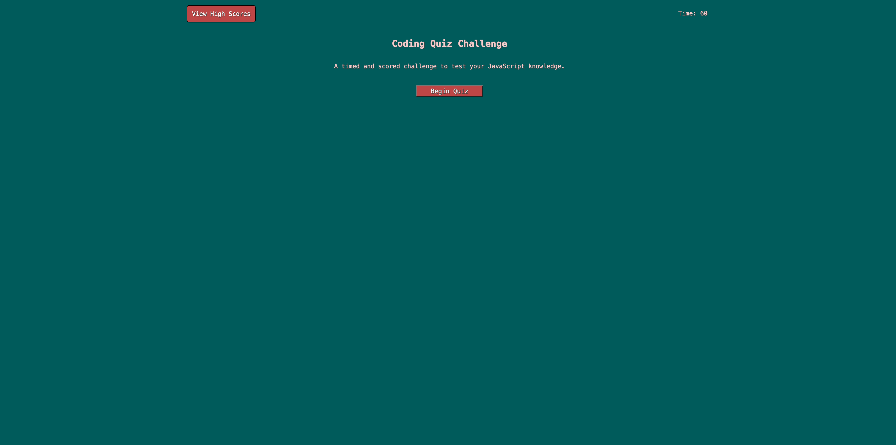
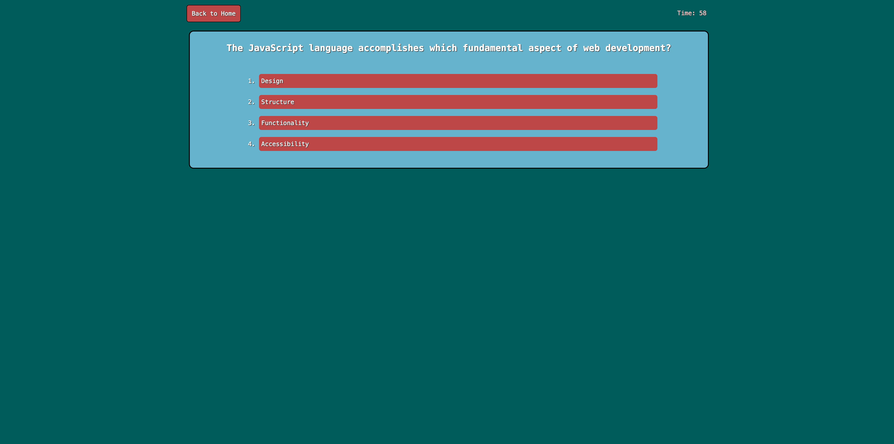
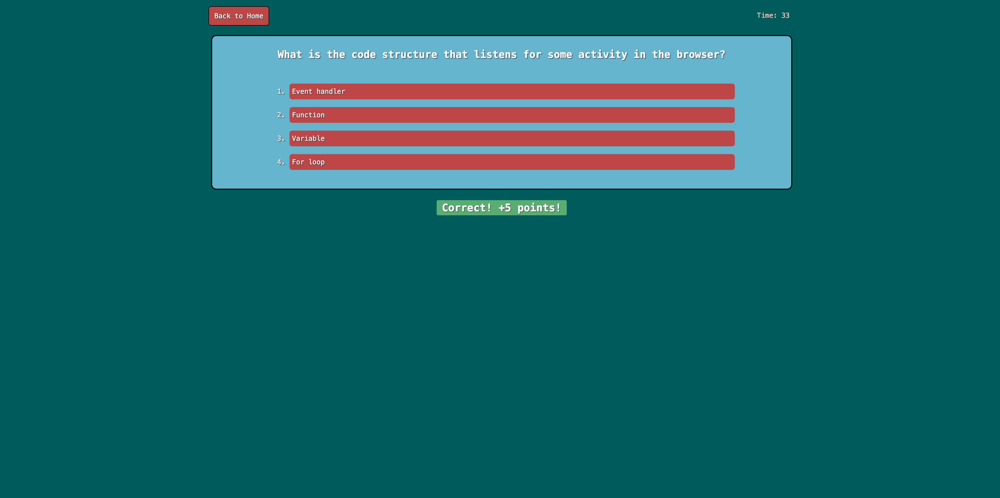
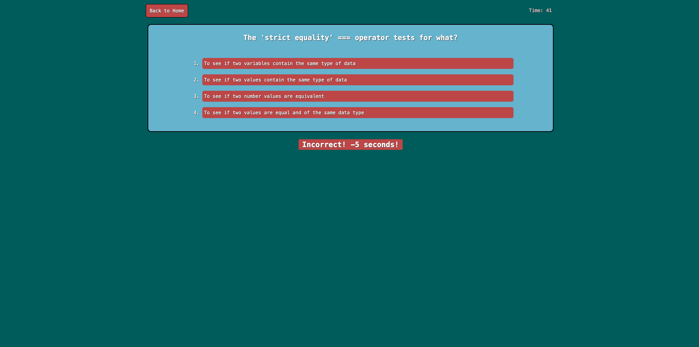
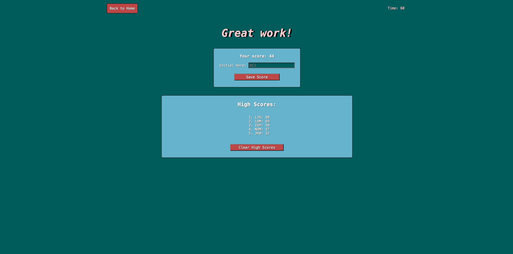
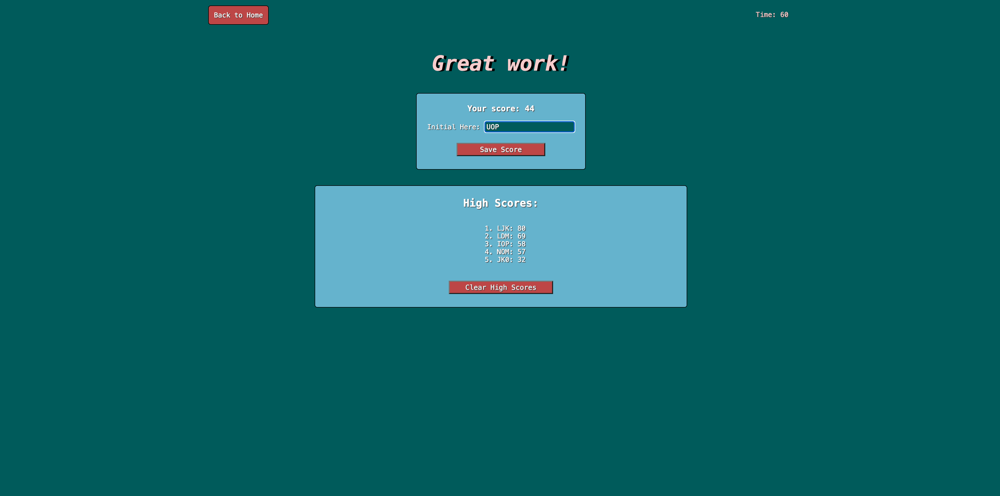
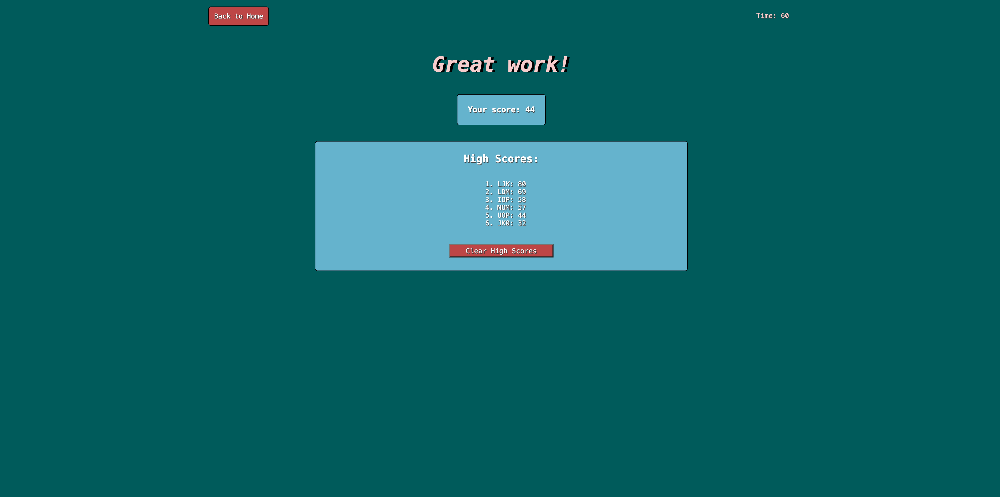
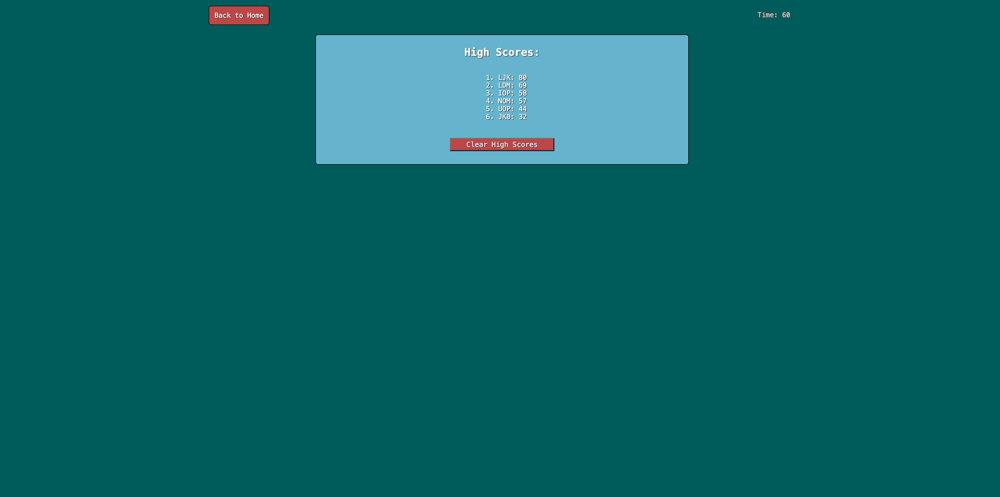
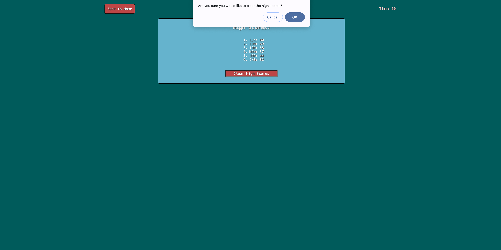
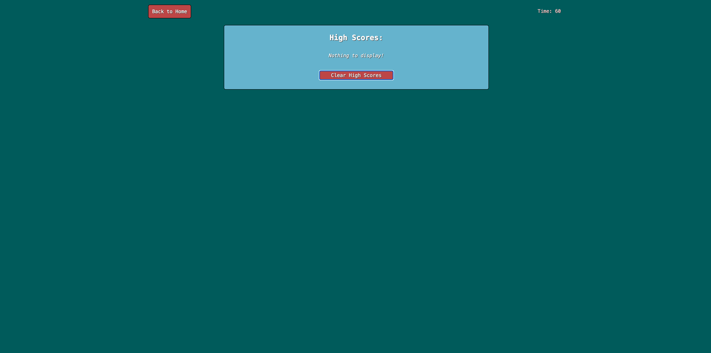

# Daniel's Coding Quiz Challenge

## Description

My most comprehensive and difficult challenge yet!

My motivation for this assignment was to create a quiz to assess mine and my peers' knowledge of JavaScript. I wanted this assessment to be scored based on accuracy and speed. 

In the creation of this quiz, I wanted to practice and implement the various JavaScript skills that I have been using in the last few weeks, as well as refresh my basic HTML and CSS skills. 

The specific JavaScript skills I used in this project are the following: 
- Variable declaration
- Function declaration
- Function calling
- return
- .getElementById method of "DOM traversal"
- Arrays
- JSON.stringify/JSON.parse
- localStorage.getItem() and localStorage.setItem()
- .dataset / use of custom HTML attributes
- .setAttribute, .getAttribute, .innerHTML, .textContent, .createElement, .appendChild: dynamically setting/changing HTML content
- if/then statements
- .sort array method, with compareFn parameter
- adding event listeners
- event delegation
- window.confirm
- for-loops/ iteration
- setInterval/clearInterval
- preventDefault
- .push/ add values to array

The biggest challenges and obstacles I faced with this challenge were related to local storage. Learning and understanding how to properly set and get data into and from local storage proved itself to be complex and challenging.

## Installation

Visit the following link to use the application: https://danrcross.github.io/daniel-code-quiz/

## Usage

Link will take you to the main page: 

When you press 'Begin Quiz', page will appear like so: 

When you answer a question correctly, it will take you to the next question,
    and give you a positive feedback:

When you answer a question incorrectly, it will take you to the next question, and give you a negative feedback:

Once you have answered the last question, you will be brought to this page:

You may then enter 3 initials, like so:

Once you hit "Save Score", the entry box will disappear, and the high score list below will be updated:

From the main page, this page displaying the high scores (in order) can be displayed:

The high score list may be reset, or cleared. The user will be asked to confirm this decision:

A cleared or empty list will appear like this: 

## Credits

Method for storing user scores and initials heavily inspired by an in-class activity: Activity 26, Module 4: To-Do list.

Thank you to my instructors for helping me to understand the use of JSON. 
Thank you to my TA, Ryan, for suggesting line 83 of my JavaScript file. I was unaware of the use of the 'or' condition to select an alternative value for a variable if one value is falsy.

The questions I created for my quiz (in my index.HTML) were inspired by the following 2 MDN articles: 

- https://developer.mozilla.org/en-US/docs/Learn/Getting_started_with_the_web/JavaScript_basics 

- https://developer.mozilla.org/en-US/docs/Web/JavaScript/Data_structures 

## License

MIT License

Copyright (c) 2024 Daniel Cross

Permission is hereby granted, free of charge, to any person obtaining a copy
of this software and associated documentation files (the "Software"), to deal
in the Software without restriction, including without limitation the rights
to use, copy, modify, merge, publish, distribute, sublicense, and/or sell
copies of the Software, and to permit persons to whom the Software is
furnished to do so, subject to the following conditions:

The above copyright notice and this permission notice shall be included in all
copies or substantial portions of the Software.

THE SOFTWARE IS PROVIDED "AS IS", WITHOUT WARRANTY OF ANY KIND, EXPRESS OR
IMPLIED, INCLUDING BUT NOT LIMITED TO THE WARRANTIES OF MERCHANTABILITY,
FITNESS FOR A PARTICULAR PURPOSE AND NONINFRINGEMENT. IN NO EVENT SHALL THE
AUTHORS OR COPYRIGHT HOLDERS BE LIABLE FOR ANY CLAIM, DAMAGES OR OTHER
LIABILITY, WHETHER IN AN ACTION OF CONTRACT, TORT OR OTHERWISE, ARISING FROM,
OUT OF OR IN CONNECTION WITH THE SOFTWARE OR THE USE OR OTHER DEALINGS IN THE
SOFTWARE.